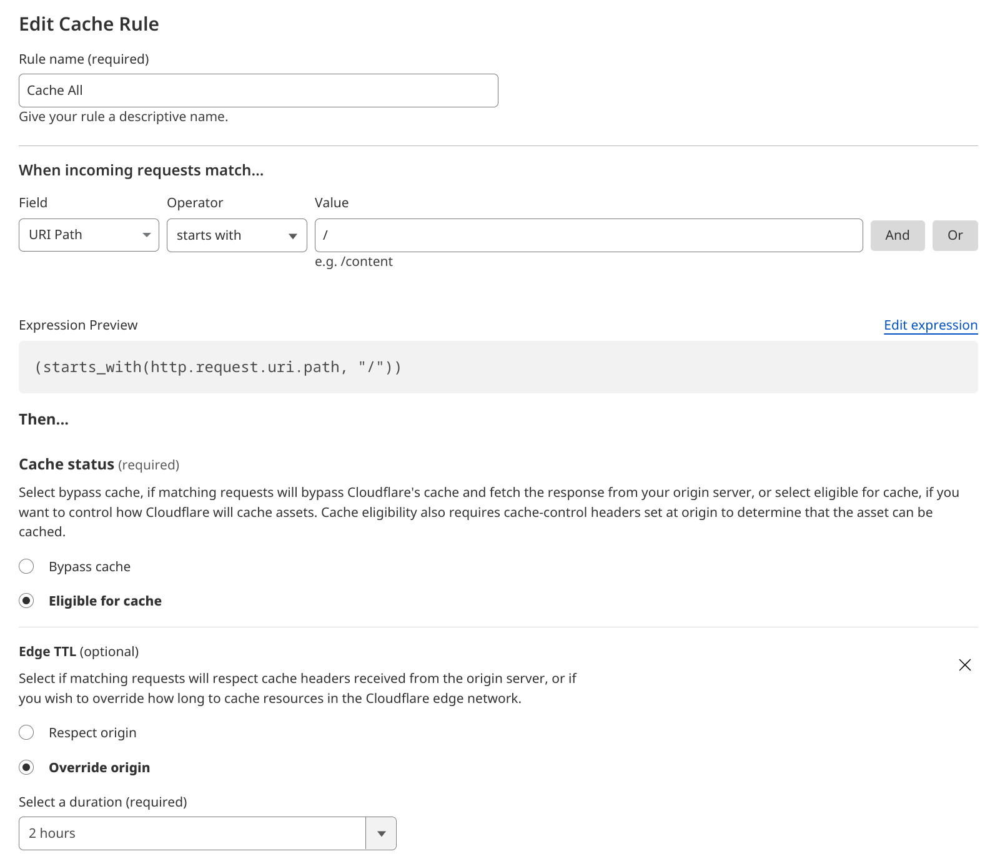
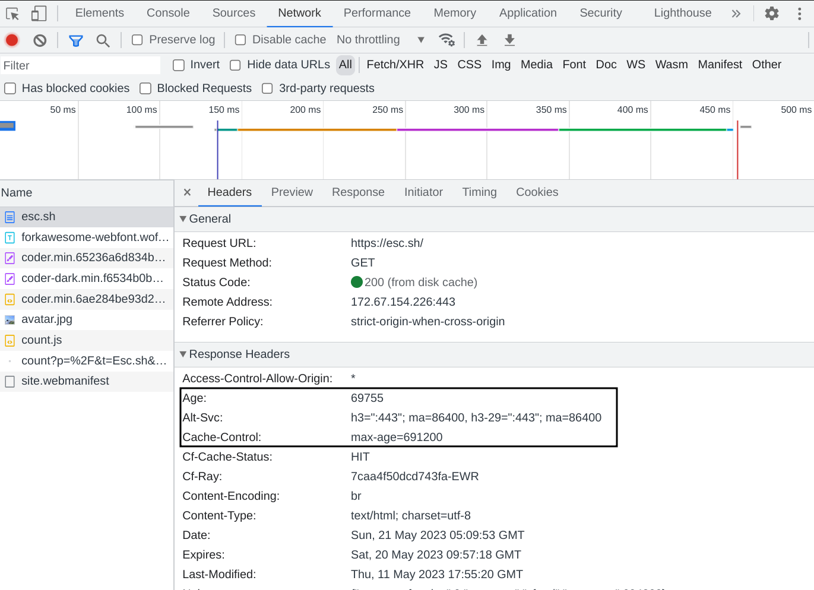

This is a quick post about how to enable HTTP caching in Cloudflare for your Ghost powered blog.

## Background

Let me start by saying that this may not work for everyone, so please read this carefully before
you set up caching by following this post.

My blog is primarily static. The only updates that happen are when I personally modify or add new content.
I've set up Cloudflare in front of my Ghost blog to manage my traffic, and now I want to make the most of 
Cloudflare's caching capabilities.

The goal? To prevent every request from hitting my Ghost server and instead, serve cached content from 
Cloudflare's edge servers to visitors.

## Step 1 : Enable Caching in Ghost

As you are aware, Ghost is configured through a config file. For example, the production config file
is called `config.production.json`, you can read more about Ghost's config options [HERE](https://ghost.org/docs/config/)

In your Ghost's config file, you should find a section called caching. If this does not exist, you can simply add it.

We're interested in two parts here: `contentAPI` and `frontend`.

- **contentAPI** deals with how long Ghost should cache the API responses.
- **frontend** controls how long the HTML from the site is cached.

So add an entry like this
```json
"caching": {
    "contentAPI": {
        "maxAge": 60
    },
    "frontend": {
        "maxAge": 600
    }
}
```


This is my final config file look like (with some redactions of course)
```json
{
    "url": "https://digitz.org",
    "database": {
    --snip--
    },
    "caching": {
        "contentAPI": {
                "maxAge": 60
        },
        "frontend": {
                "maxAge": 600
        }
    }
}
```

In this case, the API will be cached for 60 seconds and all the other pages will be
cached for 600 seconds (10 minutes), set values to your preference

## Step 2: Set Up Cloudflare (if not already done)

I am assuming that your blog is already setup with Cloudflare, if not, you can follow their
[docs](https://developers.cloudflare.com/fundamentals/get-started/setup/add-site/) and add your site to Cloudflare.


### Edge Cache vs Browser Cache: What's the Difference?

Before we dive further, let's take a brief moment to understand the difference between **edge caching** and **browser caching**. 

**Browser Cache:** When a user visits a website, the browser downloads and stores certain files from the site (like images, CSS, and JavaScript files) locally on the user's device. This is known as browser caching. The next time the user visits the same site, the browser can load these files from its local cache, instead of downloading them again from the server. This makes the website load faster for the user.

**Edge Cache:** Edge caching is a bit different. In this case, the content of the website is stored on various servers spread across the globe, known as edge servers. When a user requests a webpage, the content is delivered from the nearest edge server, instead of the original server. This reduces the load on the original server and can significantly speed up the delivery of the content, especially for users who are far away from the original server.

In our case, we're using Cloudflare, which has a large network of edge servers. By storing our blog content on these edge servers (i.e., implementing edge caching), we can reduce the load on our Ghost server and deliver content faster to our readers, no matter where they are in the world.


## Step 3 : Setup caching rule

In your Cloudflare dashboard, go to the Page Rules section. Here, create a new rule that says `URL path starts with /`. This means that the rule will apply to all the pages on your blog.

Then, in the settings, select 'Override Cache Control' and set the Edge Cache TTL to '2 hours'. This tells Cloudflare to cache your content for two hours, regardless of what your server's cache headers might be saying.

Please refer to the image



So, now you can see that there are two sections you can configure, `Edge TTL` and `Browser TTL`. If you don't understand
the difference, please read the previous section in this blog post.

So, set an appropriate value for both.

> Note: You can always easily remove the cache from Cloudflare, but you cannot remove cached content
> from a user's browser. So beware of this before choosing what TTL for caching

Once you have configured proper TTL, click `Deploy`, this will activate the caching rule


## Step 4 : Verify caching

### Using the command line - curl

If you are familiar with the command line and if you have `curl` installed, you can check if your blog is getting
cached by using the following command

```
➜  ~ curl -vso /dev/null https://your web site address/ 2>&1 | grep -i age:
< age: 2859
```

If the `age` says anything above 0, then it is getting cached. If it says 0, run that command a several times 
so that Cloudflare caches it.


### Using browser Developer tools

If you're not comfortable using curl or other command line tools, don't worry! You can verify your caching setup using Google Chrome's Developer Tools as well. Here's how to do it:

1. Open Google Chrome and navigate to your blog.

2. Right-click anywhere on the page and select 'Inspect' or simply press Ctrl + Shift + I on your keyboard. This will open Chrome's Developer Tools.

3. Go to the 'Network' tab in the Developer Tools window.

4. Now, refresh your blog page. As the page reloads, you'll see a lot of requests showing up in the Network tab.

5. Click on the name of the first request, which should be the URL of your blog. This will open up a side panel with more details about the request.

6. In this side panel, scroll down to the 'Response Headers' section. Here, you can see all the HTTP headers that your server and Cloudflare are sending with your blog's content.

7. Look for the Cache-Control and Age headers. The Cache-Control header should indicate the max-age that you've set in your Cloudflare rule, and the Age header should tell you how long the response has been cached at Cloudflare.

Refer to the image below


