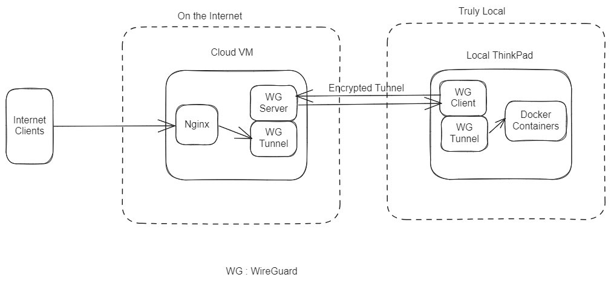
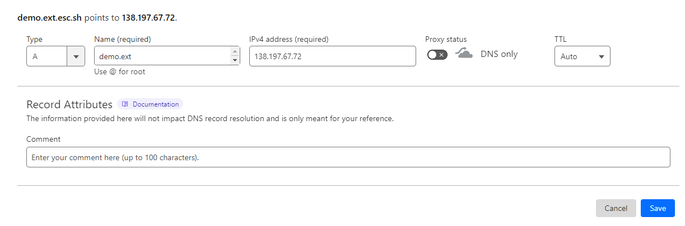
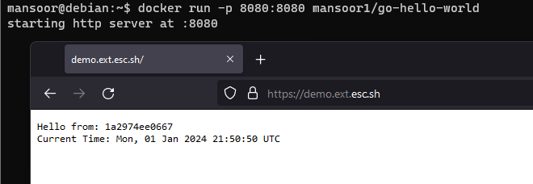

## My Setup

I have an old ThinkPad laptop running Debian 12 that is hosting some services that I use
on a daily basis. I also use the same laptop to host some internet facing services. That is,
these services should be accessible to **everyone on the internet**. And this is the setup I came up with
which seem to be a good tradeoff between cost, complexity and security.

## Common ways to expose a service to the Internet

First let us take a look at some of the common ways to expose a service to the Internet

### Port Forwarding

Port forwarding is when you configure your router to redirect requests from the internet to a specific machine in your local network.

**Pros**:
- Fairly easy to set up
- Direct access, no added cost

**Cons**:
- Huge security risk : It exposes your local network directly to the internet.
- Privacy concerns : Your home IP address is exposed. You can use services such as cloudflare to get slightly better protection
- Need for Dynamic DNS : Since your ISP probably uses dynamic IP address, you need to setup something to map a DNS address to your current IP address

**My advice**:
I personally recommend that you skip this option unless you know exactly what you are doing

### Using a traditional/Mesh VPN

While using a VPN is not directly exposing a service to the internet, I'm mentioning it because there are folks who just want to access their services while away from home. The VPN setup means creating a secure tunnel from the internet to your local network, effectively making your remote device part of the local network.

**Pros**:

- Very secure as long as you don't lose your VPN configuration
- Fairly easy to set up
- Privacy friendly

**Cons**:
- Public internet users cannot access your service if you want them to.
- Complicated (Unless you use Tailscale, then it cannot be any simpler)


**My advice**: If all you need is to access your self hosted services on your own devices, just use [TailScale](https://tailscale.com/) and do nothing else. But of course, keep reading for educational purposes

### Tunneling services

Services like Cloudflare Tunnel and Ngrok offer easy ways to expose your local services to the internet. 


**Pros**:
- Very easy to setup
- Secure

**Cons**:
- Thirdparty services, less flexibility


**My advice**: If you want a fairly easy setup, but are willing to trade privacy and flexibility, I suggest [Cloudflare tunnel](https://www.cloudflare.com/products/tunnel/)
But if you are willing to put a little bit  more effort, I suggest you try the method
I use, which is explained below.

## How I Expose my services to the Internet

TL;DR : I have a Cloud virtual machine running Nginx that acts as a reverse proxy. I have a Wireguard
server on the Cloud VM. My ThinkPad laptop connects to this CloudVM via Wireguard. The Nginx reverse
proxies directly to the VPN interface. I use Docker to run all of the services

Here is a simplified diagram showing how it fits together



**Pros**:
- Secure
- Very flexible
- Private
- Does not depend on a third party
- It's fun

**Cons**:
- You gotta pay $5 a month at least
- A bit more involve setup

## How to set it up

For this example, I will use my laptop to host a simple web service and then I will
use my Digital Ocean VM to expose it to the internet, with SSL and everything.
You can replicate the same example with slight modifications for any sort of service.

### Step 1 : Let's host a simple service locally

I have a simple demo app [HERE](https://github.com/MansoorMajeed/go-hello-world), I am going to use that.

I assume you have Docker setup and running, if not, it does not matter how you host your service,
it just have to be listening on a local port.

In my case, I am going to install Docker on a Virtual Machine and start the service from there.

```bash
docker run -p 8080:8080 mansoor1/go-hello-world
```
Once that is running, from the same machine, I can access this service
```text
mansoor@debian:~$ curl localhost:8080
Hello from: 228c90c9b4c0
Current Time: Sun, 31 Dec 2023 03:03:50 UTC
```

Great! So we have our service running locally

### Step 2 : Setting up our CloudVM

For this, you will need a Cloud VM. I personally recommend DigitalOcean or Linode.
We only need the smallest possible instance since the server will be using only
minimal stuff. You can even sign up for a AWS free account or Google Cloud trial.

For this, I will  use a DigitalOcean VM I already have.

In case you are not familiar with this, I have an old video explaining how to set it up from scratch

> Note: You do not have to configure Nginx yet, just until Nginx is installed

[](https://www.youtube.com/watch?v=kDcn9npjoPs&list=PLxYCgfC5WpnsAg5LddfjlidAHJNqRUN14&index=16)

At this point, you should have a Cloud VM running with nginx installed.

### Step 3 : Connecting your local machine to the Cloud VM via Wireguard

Now, we need to create a tunnel between the local virtual machine and the Cloud VM.

I have another post going into details about how to do that. Go ahead and follow that to set up WireGuard. HERE : [https://esc.sh/blog/wireguard-vpn-setup/](https://esc.sh/blog/wireguard-vpn-setup/)

> NOTE : In the Wireguard setup, we **DO NOT WANT our client to send INTERNET** traffic via the Cloud VM
> Make sure you don't configure that.

Once you are done with setting up Wireguard following the post I linked above, your local VM and the Cloud VM should be connected
via a tunnel.

The **Cloud VM** should be able to ping the **local VM**.

```text
mansoor@server:~$ ping -c 2 10.0.0.2  # this is the client's IP
PING 10.0.0.2 (10.0.0.2) 56(84) bytes of data.
64 bytes from 10.0.0.2: icmp_seq=1 ttl=64 time=16.3 ms
64 bytes from 10.0.0.2: icmp_seq=2 ttl=64 time=8.21 ms

--- 10.0.0.2 ping statistics ---
2 packets transmitted, 2 received, 0% packet loss, time 1002ms
rtt min/avg/max/mdev = 8.212/12.261/16.310/4.049 ms
```

> Note : If that does not work, there is likely an issue with the Wireguard configuration
> Fix this before proceeding

### Step 4 : Testing the service access from the Cloud VM

Now that we have a tunnel in place, our Nginx server (The Cloud VM) should be able to access our simple service directly.

Here, I am using `curl` to test connection to `10.0.0.2` which is the Wireguard tunnel IP for the client VM
where our service is running on port 8080 using Docker.

```text
mansoor@cloud-vm:~$ curl 10.0.0.2:8080
Hello from: 1a2974ee0667
Current Time: Mon, 01 Jan 2024 21:17:09 UTC
mansoor@cloud-vm:~$
```

Perfect! It works.

> If that does not work, but the `ping` worked in the previous step, make sure the service is running
> properly on the client machine, that docker is running with the proper flags to expose the port 8080

### Step 5 : Pointing your domain name to the Cloud VM

I want to expose my service to the internet at the domain name `demo.ext.esc.sh`.
For this, you would need a domain name, I assume you do have one.

We need to point the domain name of our choice to the **IP address of our Cloud VM**.
I use Cloudflare for DNS, so I can do that in the CloudFlare dashboard.



Verify that the DNS has been updated. I like to use `dig` command to do that. You can use
`dig` or `nslookup` or even `ping`

```text
mansoor@demo:~$ ping -c 1 demo.ext.esc.sh
PING demo.ext.esc.sh (138.197.67.72) 56(84) bytes of data.
64 bytes from demo (138.197.67.72): icmp_seq=1 ttl=64 time=0.034 ms
```

So we can see that the DNS is propagated

### Step 6 : Configuring Nginx

#### Getting TLS certificates

We can get free TLS certificates using Lets' Encrypt.

I have another blog post explaining how to do that, check that out : [Let's Encrypt + Nginx - Definitive Guide](https://esc.sh/blog/lets-encrypt-and-nginx-definitive-guide/)

Make sure to use the correct domain names.

> Note: I chose not to use `www.` part and use only `demo.ext.esc.sh`. This is up to you
> If you plan on having other people visit your website/service, it is better to have `www.`
> enabled and redirected to your root (or main) domain (or subdomain)

At the end, we should have these on the Cloud VM

- The file `/etc/nginx/snippets/letsencrypt.conf` in place
- Directory `/var/www/letsencrypt` created
- The certificate and private key under `/etc/letsencrypt/live/demo.ext.esc.sh/`
- The proper Nginx configuration at `/etc/nginx/sites-enabled/demo.ext.esc.sh`

Mine looks like this
```nginx
mansoor@demo:~$ cat /etc/nginx/sites-enabled/demo.ext.esc.sh

server {

    include /etc/nginx/snippets/letsencrypt.conf;

    server_name demo.ext.esc.sh;

    root /var/www/demo.ext.esc.sh;
    index index.html;

    listen 443 ssl; # managed by Certbot
    ssl_certificate /etc/letsencrypt/live/demo.ext.esc.sh/fullchain.pem; # managed by Certbot
    ssl_certificate_key /etc/letsencrypt/live/demo.ext.esc.sh/privkey.pem; # managed by Certbot
    include /etc/letsencrypt/options-ssl-nginx.conf; # managed by Certbot
    ssl_dhparam /etc/letsencrypt/ssl-dhparams.pem; # managed by Certbot

}
server {
    if ($host = demo.ext.esc.sh) {
        return 301 https://$host$request_uri;
    } # managed by Certbot


    listen 80;

    server_name demo.ext.esc.sh;
    return 404; # managed by Certbot
}

```

#### Proxying to our service

All we have to do now is to update the Nginx config to proxy any request to our backend.

> Note: what to add to the proxy configuration depends on what sort of application we
> are hosting. A quick google search should get you the appropriate configs

For a very simple proxy, a simple `proxy_pass` is enough

So, we add this to our Nginx configuration
```nginx
    location / {
            proxy_pass http://10.0.0.2:8080;
    }
```

The full config looks like this
```nginx
mansoor@demo:~$ cat /etc/nginx/sites-enabled/demo.ext.esc.sh
server {

    include /etc/nginx/snippets/letsencrypt.conf;

    server_name demo.ext.esc.sh;

    root /var/www/demo.ext.esc.sh;
    index index.html;

    listen 443 ssl; # managed by Certbot
    #---snip TLS stuff----

    location / {
            proxy_pass http://10.0.0.2:8080;
    }

}
#---snip----
```

Once that is done, reload Nginx

```bash
sudo systemctl reload nginx
```

### Step 7 : Testing and verifying

We are ready to test if our setup is working. Open a browser (or `curl`) to the site we configured




## Conclusion

We are all set here. If you plan to use this for any sort of production services,
It would make sense to add some sort of simple monitoring to make sure that your
service stays up. 

Leave a comment if you have any questions