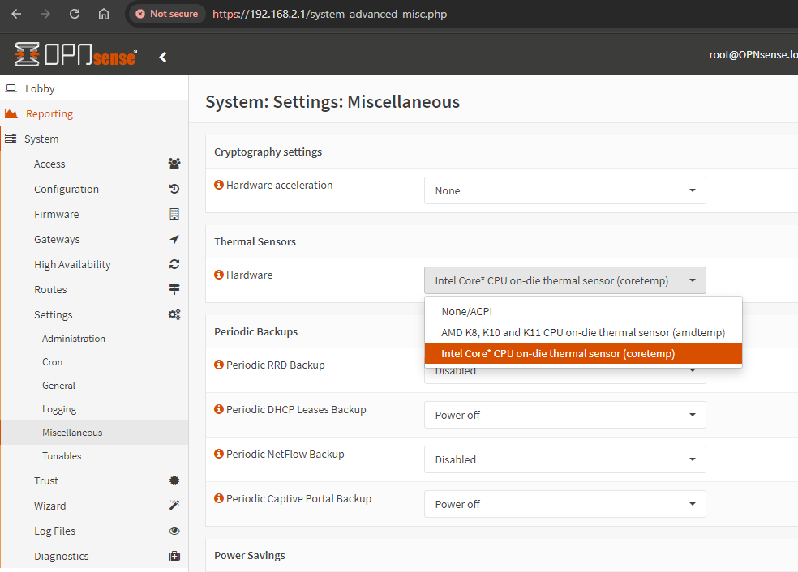
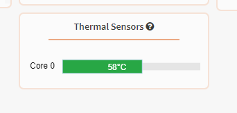

I recently migrated from pfSense to OPNsense and in my new setup (running on an n100 fanless PC)
the temperature it reported was 27.9C, it did not even change even after running a stress test.
27C is too good to be true. So I went digging through the settings and figured out why it was
reporting the wrong temperature

## The Fix

Go to System >> Settings >> Miscellaneous >> Thermal Sensors >> Hardware

Choose the appropriate hardware, in my case it was `Intel Core*`

and it started showing the correct temperature

