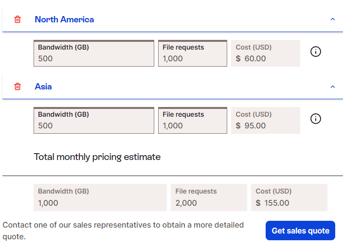
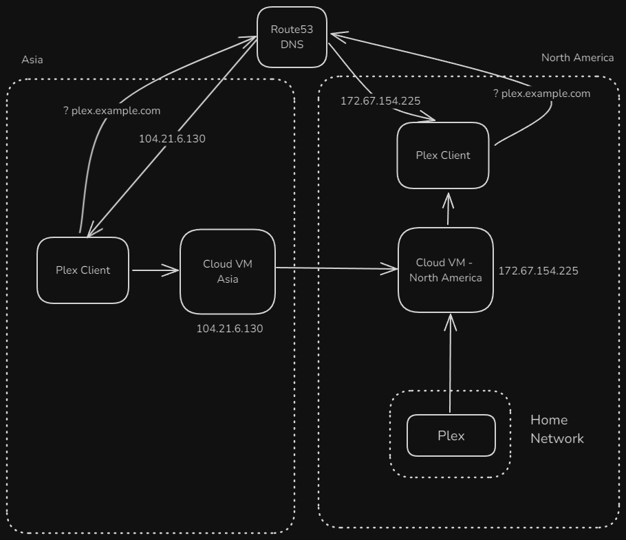
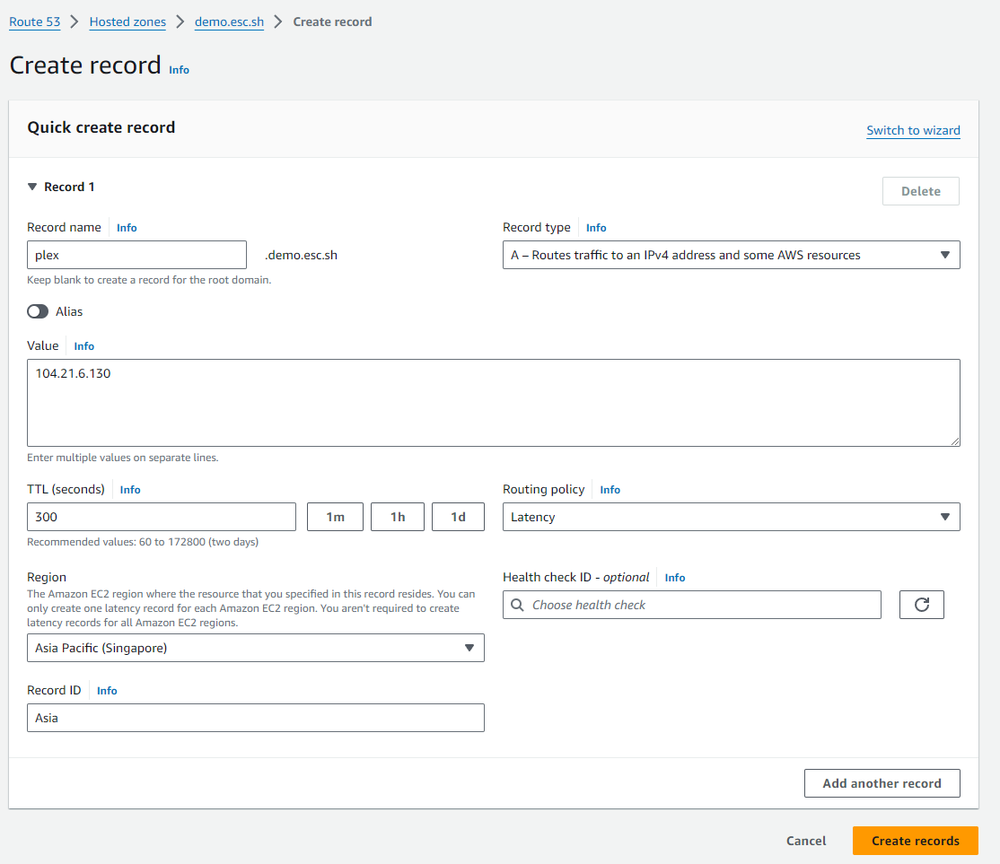
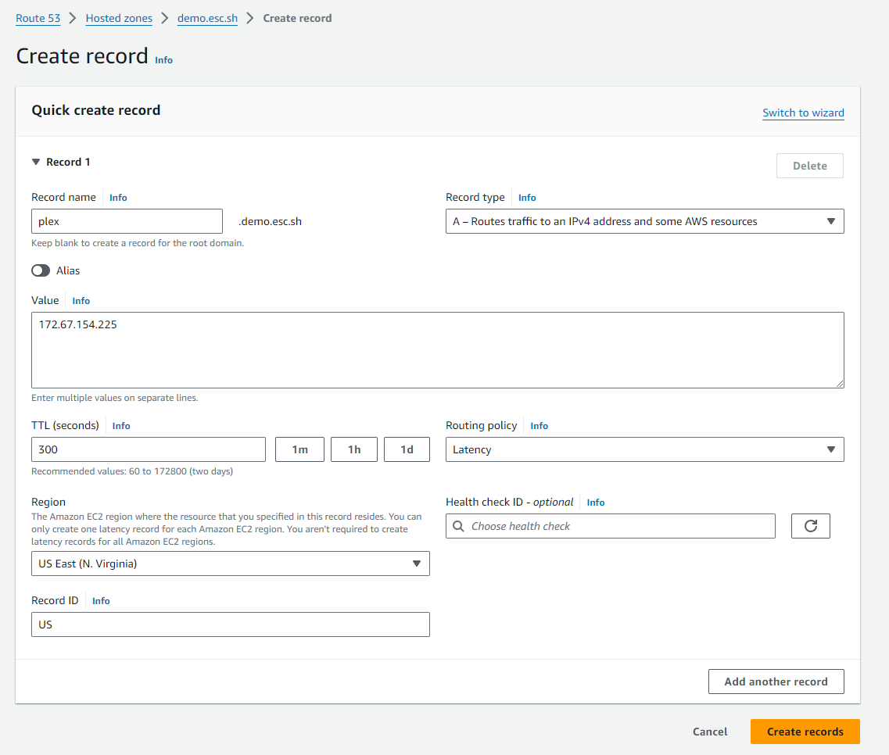

## Background

I have a Plex server, I want to share that with my friends and family

## 1st attempt : Simply host the Plex server and expose it directly + reverse proxy

This is the simplest solution. I have the Plex server running on an old Mini PC in my home
network. I have a Digital Ocean VPS acting as a reverse proxy so that I don't have to expose
my home IP directly to the internet. 

If you are interested in reading more about it, I have a post explaining how I expose my selfhosted
services to the internet, [HERE](https://esc.sh/blog/expose-selfhosted-services-to-internet/)

It worked great for people who live close to me.

## The Problem

I currently live in North America, while most of my friends and family are on the other side of
the planet, in Asia.  Streaming 4k media over such a long distance is challenging

Of course, you can't beat physics, packets can't travel faster than the speed of light. However, latency isn't the main issue for streaming; network stability is. One of the biggest factors contributing to an unstable network is the poor routes that packets take when traveling such a long distance. Not all routes are created equal—some are more congested and prone to network problems, including packet loss.

## Potential Solutions

Well, just use a CDN, right? Yes, sort of. Let's talk about it

### What about Cloudflare free tier?

Cloudflare's free tier seems like an obvious choice, but it can't be used for video streaming. Doing so violates their Terms of Service, and you risk getting your account banned.

### What about a paid CDN?

I am okay with paying a reasonable amount a month for this selfhosting hobby. Take a look at Fastly
pricing for just 1TB a month



I am not paying $150 a month for this. 

## My Solution : Build a poor man's CDN

The reason streaming over such long distances can be problematic is that the routes often taken by the packets can be pretty bad. The traffic goes through several ISPs, and some of these routes can be quite congested. A potential solution is to rely on a cloud provider that can help mitigate these routing issues by setting up two virtual machines—one in North America and one in Asia.

### What makes a traffic between two Cloud VMs better

When we route between Cloud VMs, the packets between the VM in Asia and the VM in the US takes a much better route which reduces the chances of congestion, offers better latency and offers a stable streaming experience. This is because cloud providers usually have direct peering agreements and connections with major backbone providers. As a result, even if the packets are not going through their own "private network", they are still routed through more reliable connections compared to if we were to route directly between two home ISPs

### What size Cloud VM do I need?

Honestly, if you will be doing only a few streams simultaneously, you can go with the smallest possible size.
The limit that matters is how much bandwidth it comes with

### Alright, which Cloud Provider?

I have personally used Google Cloud, Digital Ocean and Linode.

#### Google Cloud

**Pros**

Google Cloud offers global VPC (virtual private cloud), which means we can create a VM in Asia and one in US but both in the same private network within Google Cloud

Example: 
- 10.0.1.2 : asia-vm
- 10.0.1.3 : us-vm

Now we can connect the asia-vm directly to 10.0.1.3, which ensures that all the traffic remains within Google's internal network which offers the best case scenario for our streams compared to a public route.

**Cons**

Google Cloud is great if you don't plan on streaming a lot. They offer free network egress for up to 200GB per month. However, if you want to go above that, you will start spending some good money. Around `$0.12` per GB. That comes around to $120/TB. Again, that is too expensive for just the network egress for a homelab

#### Digital Ocean and Linode

I put both of them under the same umbrella because they feel more or less the same. 

- Digital Ocean offers 1TB network transfer per month for $6/month
- Linode offers 1TB transfer per month for $5/month

I initially used Digital Ocean and now trying Linode. I have no data to say one is better than the other.

## How will it work? 

It is very straight forward. Two VMs in the two geographic regions running Nginx. Using Route53 for DNS to have latency based routing



### Route53 for latency based routing

> Note: For this to work, your domain needs to be managed by Route53 for DNS. However, if you already use another provider, you don't really have to move the entire DNS setup for that domain to Route53. Instead, you can simply delegate a subdomain to Route53. Read this Cloudflare documentation for an example [HERE](https://developers.cloudflare.com/dns/manage-dns-records/how-to/subdomains-outside-cloudflare/)
> For example, `subdomain.esc.sh` can be delegated to Route53 and use Route53 to manage all subdomains below that while continuing to use the existing DNS provider for all the existing DNS records. You can choose whatever is more convenient to you.

My plex domain is `plex.example.com`. This domain's DNS is handled by AWS Route53. Through the magic of latency based routing in AWS Route53, the domain `plex.example.com` will resolve to the IP that is closer to the client that is making the DNS request. You can read more about it in AWS documentation [HERE](https://docs.aws.amazon.com/Route53/latest/DeveloperGuide/routing-policy-latency.html)


**For exammple:**
- `plex.example.com` is the domain
- `104.21.6.130` is the IP of the VM in Asia
- `172.67.154.225` is the IP of the VM in the US

Then we create two A records in Route53, and choose the routing policy of "latency based" and use these IPs as the values.

Now, when a client from Asia is making a DNS query for `plex.example.com`, it will resolve to `104.21.6.130`

#### But why do we need to use this complicated DNS setup?

In Plex, you list the server domains in an order. So you will end up with `plex-asia.example.com`, `plex-us.example.com`. And when a client tries to play a stream, Plex will use the first URL that is reachable. So, if we put the asia domain first, everyone will be routed to the asia VM. So, you see the problem

#### But is Route53 expensive?

No, it is $0.50/month per zone and then $0.60 per million queries. In my billing, it is barely above $0.5 per month

## Let's do this

We got a few things to do here. Please try to read carefully.

### Plex setup

I assume that you already have a Plex server configured and exposed to the internet. I will assume that this Plex server is available at `plex-origin.example.com`, which points to your home IP address.

If you have a different setup, like I have explained in [HERE](https://esc.sh/blog/expose-selfhosted-services-to-internet/), the idea remains the same. We will be proxying from an Nginx to this "Plex Origin" which connects to the plex instance in your home network.

### Route53 Setup

We should create a dedicated IAM user in AWS to use with Let's Encrypt to automate certificates. We will use this in a step below. 

#### Create the IAM policy to allow editing the zone

At first, we need to create a Route53 IAM policy that allows our user to edit the Zone. This is needed by the certbot, which we will use to retrieve TLS certificates.

Login to AWS. Go to IAM -> Policies -> Create policy -> JSON

Replace the whole json with the following
```json
{
    "Version": "2012-10-17",
    "Id": "certbot-dns-route53 sample policy",
    "Statement": [
        {
            "Effect": "Allow",
            "Action": [
                "route53:ListHostedZones",
                "route53:GetChange"
            ],
            "Resource": [
                "*"
            ]
        },
        {
            "Effect" : "Allow",
            "Action" : [
                "route53:ChangeResourceRecordSets"
            ],
            "Resource" : [
                "arn:aws:route53:::hostedzone/<put your zone ID here>"
            ]
        }
    ]
}
```
Make sure to replace your zone ID. You can find this under AWS -> Route53 -> Hosted Zones -> Your zone you will use for plex -> Hosted Zone ID

Click Next -> Give a name (Example: certbot-edit-zone) -> Create


#### Create the IAM user for certbot

Go to IAM -> Users -> Create user

- Give a suitable username. Example : "certbot-user"
- No need to give access to AWS management console
- Choose `Attach policies directly`
- Select the policy we just created -> Next -> Create user


#### Generate the Access Key and Secret

Click on the user we just created -> Security credentials -> Access keys -> Create access key

Choose the CLI option -> Next -> Create access key -> Download the .csv file. Keep it very safe. You can't see this again in AWS console


#### Create the latency based DNS records in Route53

Now, I assume you have added your domain or subdomain to Route53. If not, you can follow [THIS](https://docs.aws.amazon.com/Route53/latest/DeveloperGuide/migrate-dns-domain-in-use.html) documentation to do that.

Now, go to Route53 -> Hosted Zones -> Your domain -> Create record.

Create a record like shown in the screenshot



- As you can see, the Record Name : plex.demo.esc.sh. Replace this with your domain name
- Value : Should be the IP of the Asia VM (or whatever region you want to use - region 1)
- Region : Choose a region that is as close to the VM as possible. It does not matter much as long as the other record is much further away
- Record ID : Choose something that would make sense to you

Create the record.

Now, **repeat the same** for the US VM IP address.


At this point, we have two A records for `plex.example.com` pointing to two different IP addresses in two geographic location

### Cloud VM configuration

Now let us configure our reverse proxy VMs (aka poor man's CDN POPs).

> Login to both the VMs via SSH.

#### Domains we will use

We will have three domain names for Plex

- `plex.example.com` : This is our main domain for plex. We will have two records pointing to two VMs
- `plex-us.example.com` : Static DNS record pointing to the VM in the US
- `plex-asia.example.com` : Static DNS record pointing to the VM in Asia
- `plex-origin.example.com` : The IP of wherever your Plex server is. This is usually your dynamic DNS if hosting on your home network

#### Configuring TLS certificates

We will use Let'sEncrypt certificate to encrypt all traffic. Since you use Route53, it is very easy to get Letsencrypt certificates using DNS challenge.

First, install the required packages on both the VMs.
```
sudo apt update
sudo apt install certbot python3-certbot-dns-route53 nginx
```

Now, under the root user, create a file `/root/.aws/credentials`. Populate it with the credentials from the csv file we downloaded in the previous step.

It should look something like this. 
```
root@server-us:~# cat /root/.aws/credentials
[default]
aws_access_key_id = AKIAxxxxxxxxxxxx
aws_secret_access_key = 43ryNAxxxxxxxxxxxxxxxxxxxxxxxxxxxxxxxxxxxx
root@server-us:~#
```

> Note: Remember, anyone who has access to this credential have full access to modify any records on your hosted zone. So keep this safe.

Make sure to have the same in the asia VM too.

**Next, let us retrieve the certificates**

With the credentials in place, we are ready to get our TLS certificates. 

**On both the VMs**
We need to get the `plex.example.com` certificate on both the VMs
```
sudo certbot certonly --dns-route53 -d plex.example.com
```
Follow the prompts. If you have correctly configured the Route53 credentials, it should work

**On the US VM**

The VM in asia needs to connect to the VM in US via TLS. So, we also need the `plex-us.example.com` domain.
```
sudo certbot certonly --dns-route53 -d plex-us.example.com
```

#### Configuring Nginx - US VM

I adopted some of the configurations from [HERE](https://github.com/toomuchio/plex-nginx-reverseproxy) so if you face any issues with Nginx config specifically, check that repo for any potential solutions

Create the configuration at `/etc/nginx/sites-enabled/plex.example.com`.

Make sure to replace all instance of `plex.example.com` with your own domain. 

```nginx
server {
    server_name plex.example.com;
    listen 443 ssl;
    ssl_certificate /etc/letsencrypt/live/plex.example.com/fullchain.pem;
    ssl_certificate_key /etc/letsencrypt/live/plex.example.com/privkey.pem;


    # Plex has a lot of text script which is easily compressed.
    # If these settings cause playback issues with devices, remove them. (Haven't encountered any yet)
    gzip on;
    gzip_vary on;
    gzip_min_length 1000;
    gzip_proxied any;
    gzip_types text/plain text/css text/xml application/xml text/javascript application/x-javascript image/svg+xml;
    gzip_disable "MSIE [1-6]\.";

    # nginx default client_max_body_size is 1MB, which breaks Camera Upload feature from phones.
    # Increasing the limit fixes the issue.
    # Note if you are sending VERY LARGE files (e.g. 4k videos) you will need to increase this much further.
    client_max_body_size 100M;


    proxy_set_header X-Real-IP $remote_addr;
    # When using ngx_http_realip_module change $proxy_add_x_forwarded_for to '$http_x_forwarded_for,$realip_remote_addr'
    proxy_set_header X-Forwarded-For $proxy_add_x_forwarded_for;
    proxy_set_header X-Forwarded-Proto $scheme;
    proxy_set_header Sec-WebSocket-Extensions $http_sec_websocket_extensions;
    proxy_set_header Sec-WebSocket-Key $http_sec_websocket_key;
    proxy_set_header Sec-WebSocket-Version $http_sec_websocket_version;

    proxy_http_version 1.1;
    proxy_set_header Upgrade $http_upgrade;
    proxy_set_header Connection "upgrade";
    proxy_set_header Accept-Encoding ""; # Disables compression between Plex and Nginx

    # Disable buffering - send to the client as soon as the data is received from Plex.
    proxy_redirect off;
    proxy_buffering off;

    location / {
        proxy_pass https://plex-origin.example.com;
    }
}
server {
    if ($host = plex.example.com) {
        return 301 https://$host$request_uri;
    } 

    listen 80 ;
    server_name plex.example.com;
    return 404;
}
```

**Read before proceeding**

> Note: Please read this

- Ensure `plex.example.com` is replaced with your correct domain name that use withing Plex.
- Ensure `plex-origin.example.com` is replaced with the correct domain for your home IP, or wherever plex is hosted. Note that I am using `https` here, so you need to ensure that your home IP has TLS as well. If you have a wireguard/tunnel from your home network to this VM, then you can replace the `https://plex-origin.example.com;` with your address like `http://10.1.0.3:32400` for example. You get the idea


Now **on the same US VM** we need to configure the second server block which the Asia VM will connect to

Create `/etc/nginx/sites-enabled/plex-us.example.com`
```nginx
server {
    server_name plex-us.example.com;
    listen 443 ssl;
    ssl_certificate /etc/letsencrypt/live/plex-us.example.com/fullchain.pem;
    ssl_certificate_key /etc/letsencrypt/live/plex-us.example.com/privkey.pem;


    # Plex has a lot of text script which is easily compressed.
    # If these settings cause playback issues with devices, remove them. (Haven't encountered any yet)
    gzip on;
    gzip_vary on;
    gzip_min_length 1000;
    gzip_proxied any;
    gzip_types text/plain text/css text/xml application/xml text/javascript application/x-javascript image/svg+xml;
    gzip_disable "MSIE [1-6]\.";

    # nginx default client_max_body_size is 1MB, which breaks Camera Upload feature from phones.
    # Increasing the limit fixes the issue.
    # Note if you are sending VERY LARGE files (e.g. 4k videos) you will need to increase this much further.
    client_max_body_size 100M;


    proxy_set_header X-Real-IP $remote_addr;
    # When using ngx_http_realip_module change $proxy_add_x_forwarded_for to '$http_x_forwarded_for,$realip_remote_addr'
    proxy_set_header X-Forwarded-For $proxy_add_x_forwarded_for;
    proxy_set_header X-Forwarded-Proto $scheme;
    proxy_set_header Sec-WebSocket-Extensions $http_sec_websocket_extensions;
    proxy_set_header Sec-WebSocket-Key $http_sec_websocket_key;
    proxy_set_header Sec-WebSocket-Version $http_sec_websocket_version;

    proxy_http_version 1.1;
    proxy_set_header Upgrade $http_upgrade;
    proxy_set_header Connection "upgrade";
    proxy_set_header Accept-Encoding ""; # Disables compression between Plex and Nginx

    # Disable buffering - send to the client as soon as the data is received from Plex.
    proxy_redirect off;
    proxy_buffering off;

    location / {
        proxy_pass https://plex-origin.example.com;
    }

}
```

#### Configuring Nginx - Asia VM

Create `/etc/nginx/sites-enabled/plex.example.com` with the following content
Note: This is the same config as the US config, **except one thing**. The `proxy_pass` should be to the `plex-us.example.com`


```nginx
server {
    server_name plex.example.com;
    listen 443 ssl;
    ssl_certificate /etc/letsencrypt/live/plex.example.com/fullchain.pem;
    ssl_certificate_key /etc/letsencrypt/live/plex.example.com/privkey.pem;


    # Plex has a lot of text script which is easily compressed.
    # If these settings cause playback issues with devices, remove them. (Haven't encountered any yet)
    gzip on;
    gzip_vary on;
    gzip_min_length 1000;
    gzip_proxied any;
    gzip_types text/plain text/css text/xml application/xml text/javascript application/x-javascript image/svg+xml;
    gzip_disable "MSIE [1-6]\.";

    # nginx default client_max_body_size is 1MB, which breaks Camera Upload feature from phones.
    # Increasing the limit fixes the issue.
    # Note if you are sending VERY LARGE files (e.g. 4k videos) you will need to increase this much further.
    client_max_body_size 100M;


    proxy_set_header X-Real-IP $remote_addr;
    # When using ngx_http_realip_module change $proxy_add_x_forwarded_for to '$http_x_forwarded_for,$realip_remote_addr'
    proxy_set_header X-Forwarded-For $proxy_add_x_forwarded_for;
    proxy_set_header X-Forwarded-Proto $scheme;
    proxy_set_header Sec-WebSocket-Extensions $http_sec_websocket_extensions;
    proxy_set_header Sec-WebSocket-Key $http_sec_websocket_key;
    proxy_set_header Sec-WebSocket-Version $http_sec_websocket_version;

    proxy_http_version 1.1;
    proxy_set_header Upgrade $http_upgrade;
    proxy_set_header Connection "upgrade";
    proxy_set_header Accept-Encoding ""; # Disables compression between Plex and Nginx

    # Disable buffering - send to the client as soon as the data is received from Plex.
    proxy_redirect off;
    proxy_buffering off;

    location / {
        proxy_pass https://plex-us.example.com;
    }
}
server {
    if ($host = plex.example.com) {
        return 301 https://$host$request_uri;
    } 

    listen 80 ;
    server_name plex.example.com;
    return 404;
}
```

#### Test Nginx on both VM

Run this command to verify that Nginx syntax is correct
```
sudo nginx -t
```

If you see any errors, fix them. Make sure the domain names and certificate path are correct -- this is the most common mistake

#### Start Nginx

If the config is fine, run
```
sudo systemctl restart nginx
```

### Configure Plex for the domain

Now open your plex server settings -> Choose your correct server -> Settings -> Network -> Custom server access URLs
Put the domain we just configured in this post. That is, in this example, `plex.example.com`

That should be it. If you have everything configured correctly, you should be able to visit `plex.example.com` and see your Plex login page.